# UCSD Pick and Place Dataset

This dataset contains **1355** robot trajectories across two tasks: (1) picking up a pot and placing it in a sink within a kitchen environment (*200 trajectories*), and (2) picking up objects in a simple tabletop environment (*1155 trajectories*). The robot is a xArm7 robot with a two-finger gripper. The dataset is collected by a variety of policies, including human teleoperation, imitation learning, and reinforcement learning, and contains both successful and unsuccesful trajectories. Trajectories contain slight variations in initial configuration, camera pose, lighting conditions, and objects. All trajectories include (sparse) per-step reward labels generated by a combination of human annotation and a classifier.

----
<p align="center">
    <span style="font-weight: bold">Kitchen pick and place</span>
    <br/>
    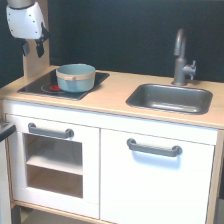
    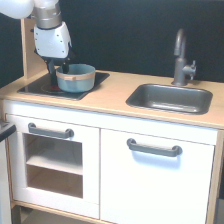
    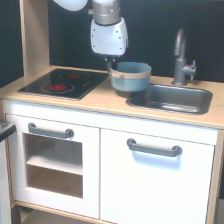
    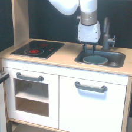
    <br/>
    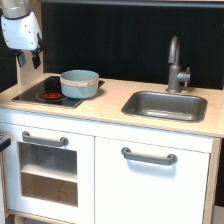
    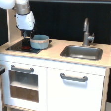
    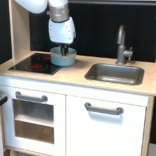
    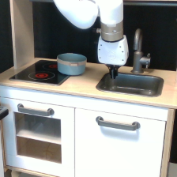
</p>

----
<p align="center">
    <span style="font-weight: bold">Tabletop picking</span>
    <br/>
    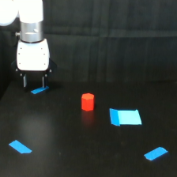
    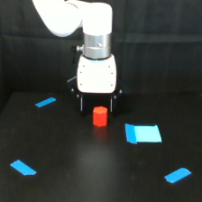
    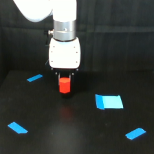
    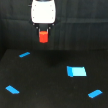
    <br/>
    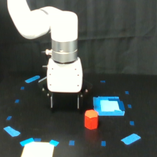
    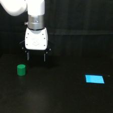
    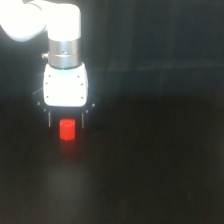
    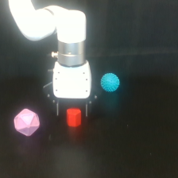
</p>


### Observations

Observations include a `224x224` RGB image captured by a static RealSense camera, as well as a 7-dimensional state vector with robot proprioceptive information: end-effector position, orientation, and distance between fingers (as a measure of 'openness').


### Actions

The robot uses velocity control. Actions are 4-dimensional, with the first three dimensions corresponding to end-effector velocities in the x, y, and z directions normalized to the interval `[-1, 1]`, and the fourth dimension corresponding to gripper open/close torque also normalized to the interval `[-1, 1]`.


### Rewards

Rewards are labeled by a combination of human annotation and a classifier. The classifier is trained on a small set of frames that are manually labeled as successful or unsuccessful, and is then used to label the remaining frames in the dataset. The majority of the dataset has been manually checked for correctness, but some noise remains. Rewards are sparse and in the interval `[0, 1]` with `1` indicating that the task has been completed successfully at the current timestep.


### Episode metadata

Each episode includes additional metadata, including:

- `file_path`: Path to the original data file.
- `n_transitions`: Number of transitions in the episode.
- `success`: True if the last state of an episode is a success state, False otherwise.
- `success_labeled_by`: Who labeled success (and thereby reward) of the episode. Can be one of: `[human, classifier]`. Most, but not all, episodes labeled by the classifier have also been manually checked for correctness by a human; see `disclaimer` below.
- `disclaimer`: Disclaimer about the particular episode. The majority of episodes have reliable reward labels. However, a fraction of the dataset has noisy reward labels, and such data points are marked with a disclaimer. Additionally, the dataset contains no successful trajectories for the green object in the tabletop environment; these trajectories are also marked with a disclaimer to indicate this.


### Citation

This dataset was collected as part of the following paper:

```
@preprint{Feng2023Finetuning,
	title={Finetuning Offline World Models in the Real World},
	author={Yunhai Feng, Nicklas Hansen, Ziyan Xiong, Chandramouli Rajagopalan, Xiaolong Wang},
	year={2023}
}
```

If you use this dataset in your research, please consider citing the paper.
